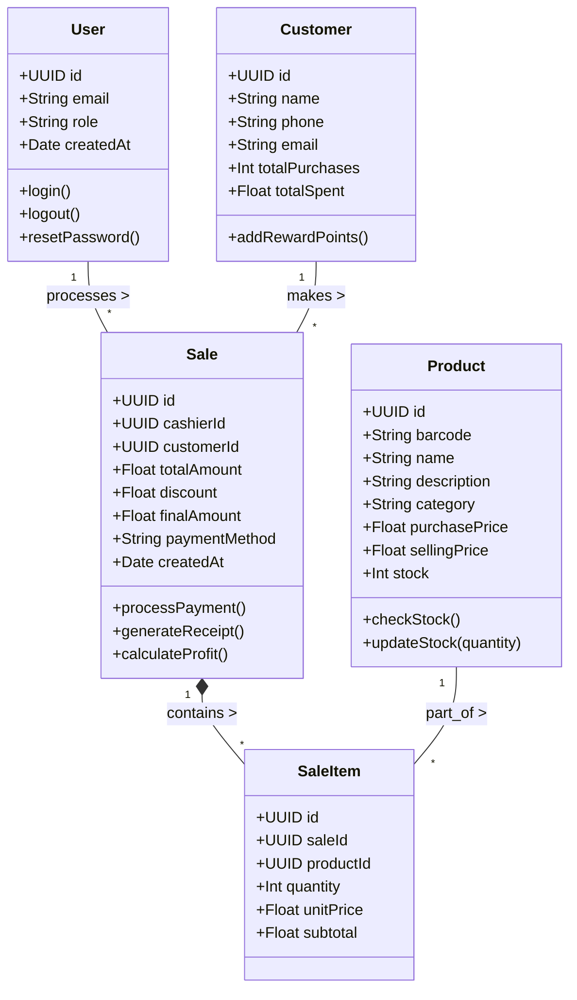
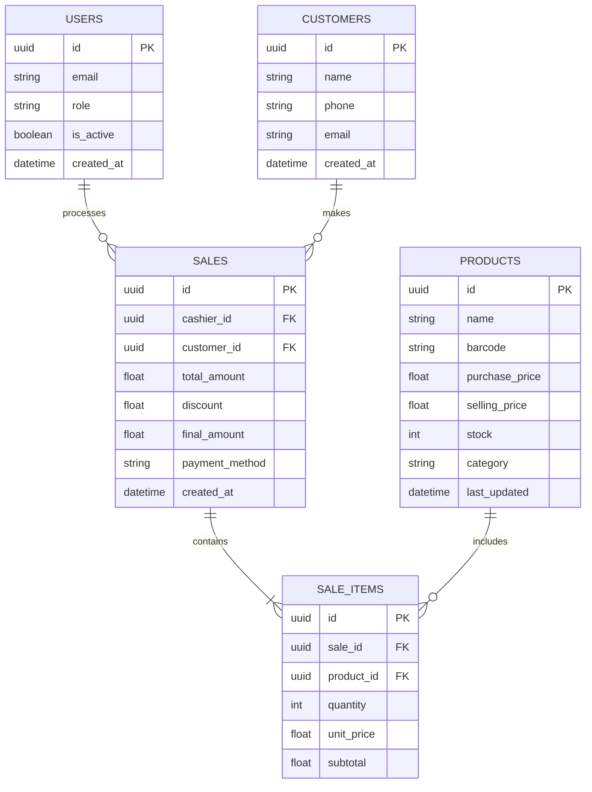
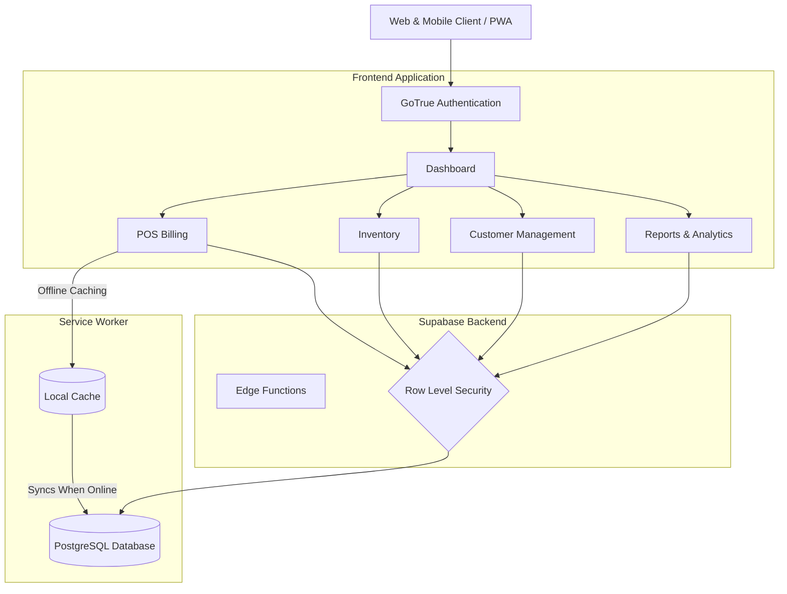
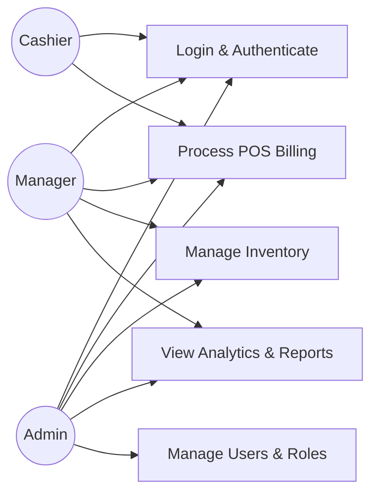

# NEXA POS - UML & Architecture Diagrams

This file contains the Unified Modeling Language (UML) and Entity-Relationship (ER) diagrams for the NEXA POS system. These diagrams use [Mermaid.js](https://mermaid.js.org/) syntax and can be viewed directly in compatible Markdown viewers or GitHub.

## 1. Class Diagram

This diagram outlines the core data structures, classes, and their relationships within the application layer.

---

## 2. Entity-Relationship (ER) Diagram

Represents the relational database structure implemented in Supabase (PostgreSQL).

---

## 3. System Architecture & Flow

This flowchart demonstrates the application's offline-first architecture and module flow.

---

## 4. User Roles & Access Use Cases

